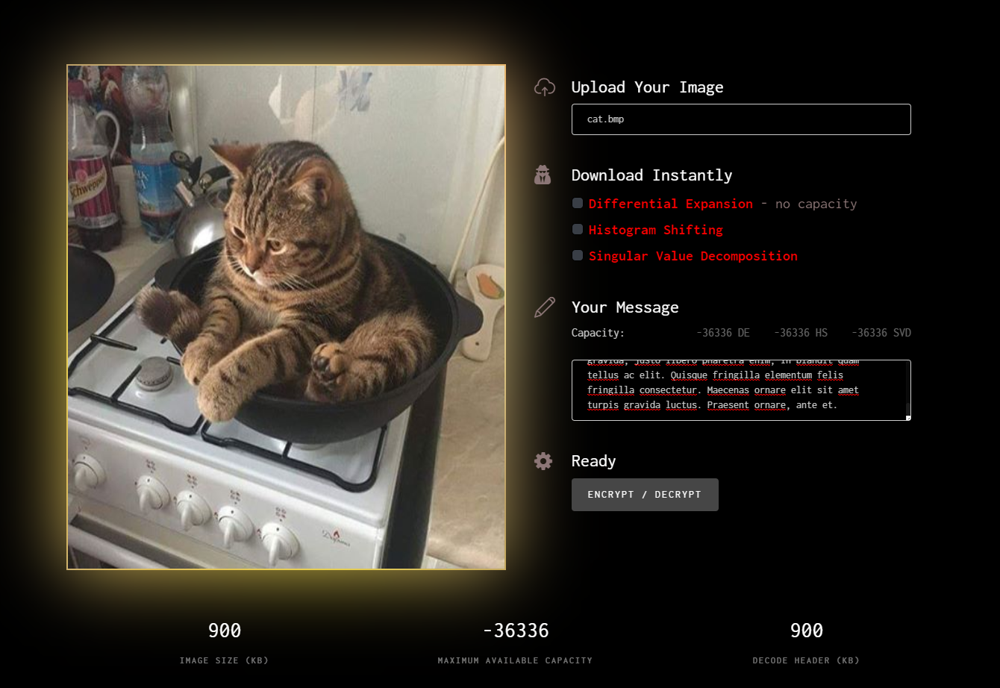
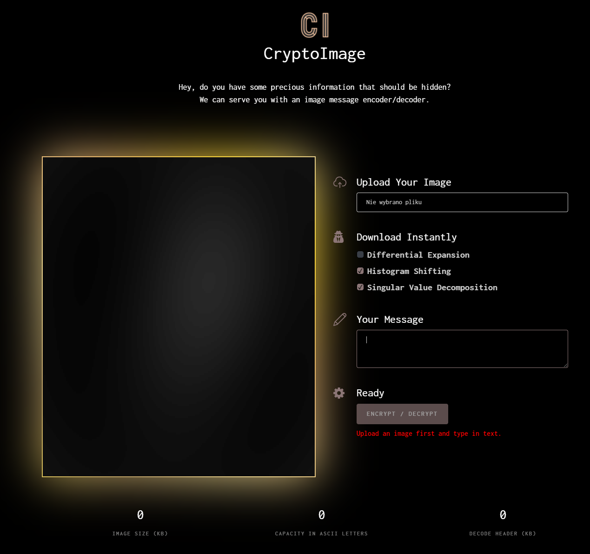
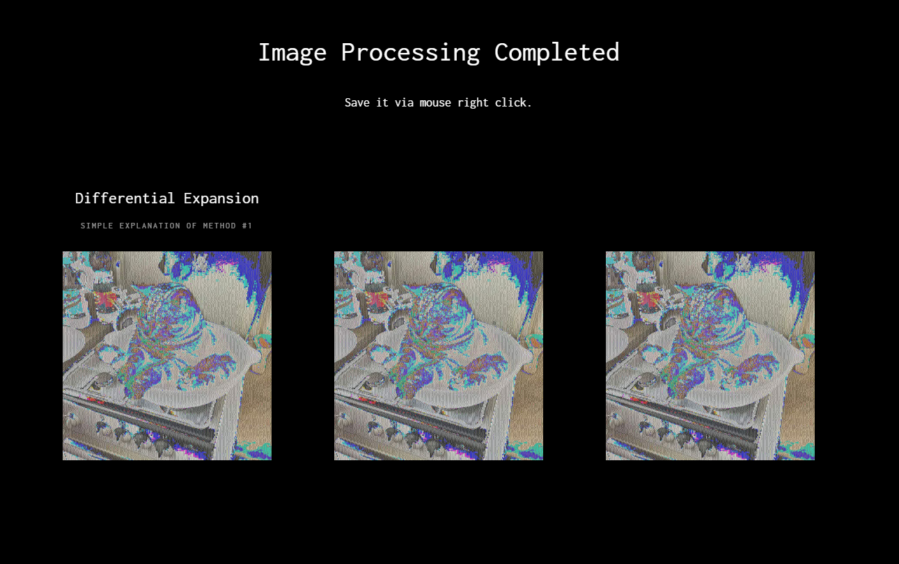

# Changelog

All notable changes to this project will be documented in this file.

The format is based on [Keep a Changelog](https://keepachangelog.com/en/1.0.0/),
and this project adheres to [Semantic Versioning](https://semver.org/spec/v2.0.0.html).

---

## [[0.15.2]] - 2022-01-15 _(MJ)_

###### _([diff: 0.15.1-0.15.2])_

Added:

- `UserFlowHandler` class

Changed:

- Moved globally scoped HTMLElements to `UserFlowHandler` class
- Moved globally scoped Fullscreen related functions to `UserFlowHandler` -> `Fullscreen` class

## [[0.15.1]] - 2022-01-15 _(MJ)_

###### _([diff: 0.15.0-0.15.1])_

Added:

- JQuery Types

## [[0.15.0]] - 2022-01-15 _(MJ)_

###### _([diff: 0.14.0-0.15.0])_

Added:

- Exceeded Capacity Check for Image Generation

Changed:

- Massive refactor of [`main.ts`](./src/main.ts) file.
- Removed the Work in Progress label from Histogram Shifting

## [[0.14.0]] - 2022-01-15 _(MJ)_

###### _([diff: 0.13.0-0.14.0])_

Added:

- [`REPORT.md`](./docs/REPORT.md) file that covers the final report of the project.
- Connected the Histogram Shifting Capacity Counter

## [[0.13.0]] - 2022-01-10 _(KS)_

###### _([diff: 0.12.0-0.13.0])_

Histogram Shifting - Decryption

## [[0.12.0]] - 2021-12-29 _(MJ)_

###### _([diff: 0.11.3-0.12.0])_

Added:

- UI: Separate Ascii Characters Left Counters for each algorithm
- UX: Colorizing the algorithms for which the message has exceed the available capacity

## [[0.11.3]] - 2021-12-15 _(KS)_

###### _([diff: 0.11.2-0.11.3])_

Histogram Shifting

## [[0.11.2]] - 2021-12-08 _(MJ)_

###### _([diff: 0.11.1-0.11.2])_

Added:

- Histogram Shifting output is now visible on the webpage
- Console check whether the decrypted messages match the original messages

## [[0.11.1]] - 2021-12-08 _(MJ)_

###### _([diff: 0.11.0-0.11.1])_

Added:

- Singular Value Decomposition output is now visible on the webpage

Changed:

- Histogram Shifting has now _W.I.P._ label (Work In Progress)

## [[0.11.0]] - 2021-12-08 _(MJ)_

###### _([diff: 0.10.3-0.11.0])_

Added:

- Custom Themed Checkboxes
- Two paragraphs in [`README.md`](../README.md) in Introduction.
- **Images are now downloadable** via right mouse click.

Changed:

- **Now images are loaded in a new way, w/o external libraries**
- Stylized focus color to match the them of all inputs.
- Increased the font weight of error tooltip.
- Cleaned up [`main.ts`](../src/main.ts)
- Cleaned up [`index.html`](../index.html)

Removed:

- External library for image loading.

## [[0.10.3]] - 2021-12-08 _(JW)_

###### _([diff: 0.10.2-0.10.3])_

Singular Value Decomposition - Encoding Implementation

## [[0.10.2]] - 2021-12-08 _(KS)_

###### _([diff: 0.10.1-0.10.2])_

Histogram Shifting - Encoding Implementation

## [[0.10.1]] - 2021-12-01 _(MJ)_

###### _([diff: 0.10.0-0.10.1])_

Changed:

- Customized animation times for hover in and out
- A bit more styling for the enlarged image

## [[0.10.0]] - 2021-12-01 _(MJ)_

###### _([diff: 0.9.0-0.10.0])_

Added:

- The results images are now clickable!
  - After the click, image is enlarged to full screen in ala "lightbox" like effect (it is always horizontally & vertically centred).
  - The second click will not use fade-in animations deliberately for faster responsiveness.
- Now, the _CAPACITY IN ASCII LETTERS_ counter live-updates itself based on the number of characters used in the input.

Changed:

- Counters are now much faster.

Fixed:

- Image Size now properly displays the number in `KB` instead of `B`.

## [[0.9.0]] - 2021-11-25 _(MJ)_

###### _([diff: 0.8.0-0.9.0])_

Added:

- Now the results section is hidden until encryption/decryption operation is executed by user
- After encryption, website smoothly navigates to the results section
- Counters are now functional
- Borders in Credits Section

## [[0.8.0]] - 2021-11-21 _(MJ)_

###### _([diff: 0.7.3-0.8.0])_

Added:

- Big shiny animated border to catch users attention
  - 
- Handling the situation when user, after inserting an image, adds another one to the website.
- Properly inserting the preview of the image after input.
- Added styling to the encoded images (rounded corners, themed border)

## [[0.7.3]] - 2021-11-14 _(KS)_

###### _([diff: 0.7.2-0.7.3])_

Difference Expansion

## [[0.7.2]] - 2021-11-13 _(KS)_

###### _([diff: 0.7.1-0.7.2])_

Huffman Compression

## [[0.7.1]] - 2021-11-13 _(MJ)_

###### _([diff: 0.7.0-0.7.1])_

Added:

- Decoded Image Display on Main Website.
  - 

Changed:

- More meaningful identifiers for HTML Elements.

## [[0.7.0]] - 2021-11-13 _(MJ)_

###### _([diff: 0.6.2-0.7.0])_

Added:

- Image Loading to main website.
  - 
- Handling all user inputs
- Safe Checks
- Tooltip updates depending on the missing information

Changed:

- Code Flow in [`main.ts`]
- Compile target from  `es2019` to `es2021`
- Module from `commonjs` to `esnext`

## [[0.6.2]] - 2021-11-01 _(KS)_

## [[0.6.1]] - 2021-10-30 _(KS)_

## [[0.6.0]] - 2021-10-29 _(MJ)_

**The Project from now is written in TypeScript. 🎉**

###### _([diff: 0.5.1-0.6.0])_

Added:

- TypeScript configuration [`tsconfig.json`](../tsconfig.json).
- New development section in [`README.md`](../README.md#Development).

Changed:

- All the source code files from `/src/` from `.js` to `.ts`.

TODO:

- Not everything is typed yet, tiny bit of work left to do.

## [[0.5.1]] - 2021-10-29 _(MJ)_

###### _([diff: 0.5.0-0.5.1])_

Added:

- `pixel3DArrayToChannelArray()` implementation in [`histogram-shifting.js`](../src/algorithms/histogram-shifting.js)

## [[0.5.0]] - 2021-10-26 _(JW)_

###### _([diff: 0.4.1-0.5.0])_

Added:

- [_Reversible Data Hiding_](./docs/papers/Reversible_data_hiding.pdf) - a paper on histogram shifting
- Directory `/src/algorithms/` with three javascript files containg basic structure of three chosen encryption methods

Changed:

- `main.js` now invokes the (not yet finished) encryption methods of the `/src/algorithms/` directory instead of the sample methods from `/src/algorithms.js` (which was removed)

## [[0.4.1]] - 2021-10-26 _(MJ)_

###### _([diff: 0.4.0-0.4.1])_

Changed:

- Moved encoders from `main.js` to separate [`algorithms.js`](../src/algorithms.js) file
- Moved `bmp-encoder-decoder.js` to separate [`/src/encoders`](../src/encoders) directory and renamed it to [`bmp.js`](../src/encoders/bmp.js)

## [[0.4.0]] - 2021-10-26 _(MJ)_

###### _([diff: 0.3.0-0.4.0])_

**Converter Form responsiveness.**

Added:

- Prepared the [`main.js`](../src/main.js) for the user usage-flow logic handling & tiny structurization
  - Temporary downloads example based on the checkbox inputs
  - Variable which holds the text for encryption with on-key-change updates
  - Functions and logic checks for each encryption method
  - Variables holding the counter labels
- Some ID's in the index.html to get the HTML elements
- Constraint for the input, limited _(currently)_ only to `.bmp` filetype
- Tooltip for Encoder Button
  - Disabled it by default
  - After user uploads an image, it is enabled
  - If he tries to press the button before uploading an image, a tooltip will apear
  - Tooltip is hidden after the image is uploaded
  - 

Changed:

- Moved the examples from [`main.js`](../src/main.js) to [`examples.js`](../src/examples.js)

## [[0.3.0]] - 2021-10-21 _(KS)_

###### _([diff: 0.2.0-0.3.0])_

**BMP Decoder / Encoder class & Blob Downloader.**

Added:

- BMP Encoder / Decoder
  - Properties:
    - `bytesPerPixel`
    - `fileSize`
    - `height`
    - `width`
    - `plainPixelsData`
    - `pixels3D`
- Blob Downloader

## [[0.2.0]] - 2021-10-13 _(MJ)_

###### _([diff: 0.1.1-0.2.0])_

**Massive Update. Fully styled website on which we are going to implement stuff.**

Added:

- **Styled Website** inside the main directory. Website should be available [here](https://luzkan.github.io/CryptoImage/).
- Website is divided into three sections:
  - _Main Encoder/Decoder_
    - There is a place for a future [`canvas`](https://developer.mozilla.org/en-US/docs/Web/API/Canvas_API) which can be used to transform & manipulate the image ([hint](https://stackoverflow.com/questions/7373851/reading-the-rgb-value-of-a-canvas-pixel))
    - Simple three steps for the user:
      1. Image Upload
      2. Desired Method conversion checkboxes
      3. Message Textfield
    - Counters which indicate the total space, available space and encrypted header decode message in `KB's`,
    - 
  - _Results_
    - Presented as images based on the previously checked checkboxes + the original/decoded image.
    - 
  - _Credits_
    - Section to gain some social credit for us if the project succeed. _xD_
    - 
- Everything website related can be found in the [`assets`](../assets) directory - the [_vendor javascripts_](../assets/js), [_css_](../assets/css), [_fonts_](../assets/fonts) and [_images_](../assets/images).
- Logo for our project! 🎉
  - 
  - Corresponding `.ico` file was added in [`./assets/icons/favicon.ico`](../assets/icons/favicon.ico)
- Updated `README.md` with link to the website.

## [[0.1.1]] - 2021-10-11 _(MJ)_

###### _([diff: 0.1.0-0.1.1])_

**Tiny update w/ team members.**

Added:

- _Team_ section in [**`README.md`**](../README.md).

## [[0.1.0]] - 2021-10-10 _(JW)_

###### _([diff: 0.0.1-0.1.0])_

**Articles related to the subject of the project have been linked.**

Added:

- 4 articles related to the project into `/docs/papers/` directory:

  - [_Analiza właściwości metod steganografii odwracalnej._](./docs/papers/Analysis_of_properties_of_reversible_steganography_methods.pdf)
  - [_Lossless generalized-LSB data embedding._](./docs/papers/Lossless_generalized-LSB_data_embedding.pdf)
  - [_Efficient Image Reversible Data Hiding Technique Based on Interpolation Optimization._](./docs/papers/Efficient_image_reversible_data_hiding_technique_based_on_interpolation_optimization.pdf)
  - [_Comparative study on different reversible image data hiding techniques._](./docs/papers/Comparative_study_on_different_reversible_image_data_hiding_techniques.pdf)

- _Related work_ section to [**`README.md`**](../README.md).

## [[0.0.1]] - 2021-10-17 _(MJ)_

###### _([diff: 0.0.0-0.0.1])_

Added:

- Created [**`DevelopmentWorkCulture.md`**](../docs/DevelopmentWorkCulture.md) for the project that contains some rules how we can make working together easier.

## [[0.0.0]] - 2021-10-07 _(MJ)_

**Project was initialized.**

### Added

- Created [**`CHANGELOG.md`**](../docs/CHANGELOG.md) for the project that contains the history of changes for this project.
- Created [**`README.md`**](../README.md) for the project that contains various useful information, requirements and instructions in order ot run the program.

[diff: 0.15.1-0.15.2]: https://github.com/Luzkan/CryptoImage/compare/0.15.1...0.15.2
[diff: 0.15.0-0.15.1]: https://github.com/Luzkan/CryptoImage/compare/0.15.0...0.15.1
[diff: 0.14.0-0.15.0]: https://github.com/Luzkan/CryptoImage/compare/0.14.0...0.15.0
[diff: 0.13.0-0.14.0]: https://github.com/Luzkan/CryptoImage/compare/0.13.0...0.14.0
[diff: 0.12.0-0.13.0]: https://github.com/Luzkan/CryptoImage/compare/0.12.0...0.13.0
[diff: 0.11.3-0.12.0]: https://github.com/Luzkan/CryptoImage/compare/0.11.3...0.12.0
[diff: 0.11.2-0.11.3]: https://github.com/Luzkan/CryptoImage/compare/0.11.2...0.11.3
[diff: 0.11.1-0.11.2]: https://github.com/Luzkan/CryptoImage/compare/0.11.1...0.11.2
[diff: 0.11.0-0.11.1]: https://github.com/Luzkan/CryptoImage/compare/0.11.0...0.11.1
[diff: 0.10.3-0.11.0]: https://github.com/Luzkan/CryptoImage/compare/0.10.3...0.11.0
[diff: 0.10.2-0.10.3]: https://github.com/Luzkan/CryptoImage/compare/0.10.2...0.10.3
[diff: 0.10.1-0.10.2]: https://github.com/Luzkan/CryptoImage/compare/0.10.1...0.10.2
[diff: 0.10.0-0.10.1]: https://github.com/Luzkan/CryptoImage/compare/0.10.0...0.10.1
[diff: 0.9.0-0.10.0]: https://github.com/Luzkan/CryptoImage/compare/0.9.0...0.10.0
[diff: 0.8.0-0.9.0]: https://github.com/Luzkan/CryptoImage/compare/0.8.0...0.9.0
[diff: 0.7.3-0.8.0]: https://github.com/Luzkan/CryptoImage/compare/0.7.3...0.8.0
[diff: 0.7.2-0.7.3]: https://github.com/Luzkan/CryptoImage/compare/0.7.2...0.7.3
[diff: 0.7.1-0.7.2]: https://github.com/Luzkan/CryptoImage/compare/0.7.1...0.7.2
[diff: 0.7.0-0.7.1]: https://github.com/Luzkan/CryptoImage/compare/0.7.0...0.7.1
[diff: 0.6.2-0.7.0]: https://github.com/Luzkan/CryptoImage/compare/0.6.2...0.7.0
[diff: 0.6.1-0.6.2]: https://github.com/Luzkan/CryptoImage/compare/0.6.1...0.6.2
[diff: 0.6.0-0.6.1]: https://github.com/Luzkan/CryptoImage/compare/0.6.0...0.6.1
[diff: 0.5.1-0.6.0]: https://github.com/Luzkan/CryptoImage/compare/0.5.1...0.6.0
[diff: 0.5.0-0.5.1]: https://github.com/Luzkan/CryptoImage/compare/0.5.0...0.5.1
[diff: 0.4.1-0.5.0]: https://github.com/Luzkan/CryptoImage/compare/0.4.1...0.5.0
[diff: 0.4.0-0.4.1]: https://github.com/Luzkan/CryptoImage/compare/0.4.0...0.4.1
[diff: 0.3.0-0.4.0]: https://github.com/Luzkan/CryptoImage/compare/0.3.0...0.4.0
[diff: 0.2.0-0.3.0]: https://github.com/Luzkan/CryptoImage/compare/0.2.0...0.3.0
[diff: 0.1.1-0.2.0]: https://github.com/Luzkan/CryptoImage/compare/0.1.1...0.2.0
[diff: 0.1.0-0.1.1]: https://github.com/Luzkan/CryptoImage/compare/0.1.0...0.1.1
[diff: 0.0.1-0.1.0]: https://github.com/Luzkan/CryptoImage/compare/0.0.1...0.1.0
[diff: 0.0.0-0.0.1]: https://github.com/Luzkan/CryptoImage/compare/0.0.0...0.0.1
[0.15.2]: https://github.com/Luzkan/CryptoImage/releases/tag/0.15.2
[0.15.1]: https://github.com/Luzkan/CryptoImage/releases/tag/0.15.1
[0.15.0]: https://github.com/Luzkan/CryptoImage/releases/tag/0.15.0
[0.14.0]: https://github.com/Luzkan/CryptoImage/releases/tag/0.14.0
[0.13.0]: https://github.com/Luzkan/CryptoImage/releases/tag/0.13.0
[0.12.0]: https://github.com/Luzkan/CryptoImage/releases/tag/0.12.0
[0.11.3]: https://github.com/Luzkan/CryptoImage/releases/tag/0.11.3
[0.11.2]: https://github.com/Luzkan/CryptoImage/releases/tag/0.11.2
[0.11.1]: https://github.com/Luzkan/CryptoImage/releases/tag/0.11.1
[0.11.0]: https://github.com/Luzkan/CryptoImage/releases/tag/0.11.0
[0.10.3]: https://github.com/Luzkan/CryptoImage/releases/tag/0.10.3
[0.10.2]: https://github.com/Luzkan/CryptoImage/releases/tag/0.10.2
[0.10.1]: https://github.com/Luzkan/CryptoImage/releases/tag/0.10.1
[0.10.0]: https://github.com/Luzkan/CryptoImage/releases/tag/0.10.0
[0.9.0]: https://github.com/Luzkan/CryptoImage/releases/tag/0.9.0
[0.8.0]: https://github.com/Luzkan/CryptoImage/releases/tag/0.8.0
[0.7.3]: https://github.com/Luzkan/CryptoImage/releases/tag/0.7.3
[0.7.2]: https://github.com/Luzkan/CryptoImage/releases/tag/0.7.2
[0.7.1]: https://github.com/Luzkan/CryptoImage/releases/tag/0.7.1
[0.7.0]: https://github.com/Luzkan/CryptoImage/releases/tag/0.7.0
[0.6.2]: https://github.com/Luzkan/CryptoImage/releases/tag/0.6.2
[0.6.1]: https://github.com/Luzkan/CryptoImage/releases/tag/0.6.1
[0.6.0]: https://github.com/Luzkan/CryptoImage/releases/tag/0.6.0
[0.5.1]: https://github.com/Luzkan/CryptoImage/releases/tag/0.5.1
[0.5.0]: https://github.com/Luzkan/CryptoImage/releases/tag/0.5.0
[0.4.1]: https://github.com/Luzkan/CryptoImage/releases/tag/0.4.1
[0.4.0]: https://github.com/Luzkan/CryptoImage/releases/tag/0.4.0
[0.3.1]: https://github.com/Luzkan/CryptoImage/releases/tag/0.3.1
[0.3.0]: https://github.com/Luzkan/CryptoImage/releases/tag/0.3.0
[0.2.0]: https://github.com/Luzkan/CryptoImage/releases/tag/0.2.0
[0.1.1]: https://github.com/Luzkan/CryptoImage/releases/tag/0.1.1
[0.1.0]: https://github.com/Luzkan/CryptoImage/releases/tag/0.1.0
[0.0.1]: https://github.com/Luzkan/CryptoImage/releases/tag/0.0.1
[0.0.0]: https://github.com/Luzkan/CryptoImage/releases/tag/0.0.0
