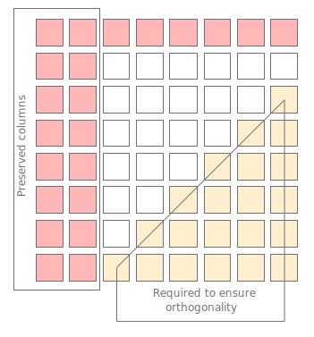
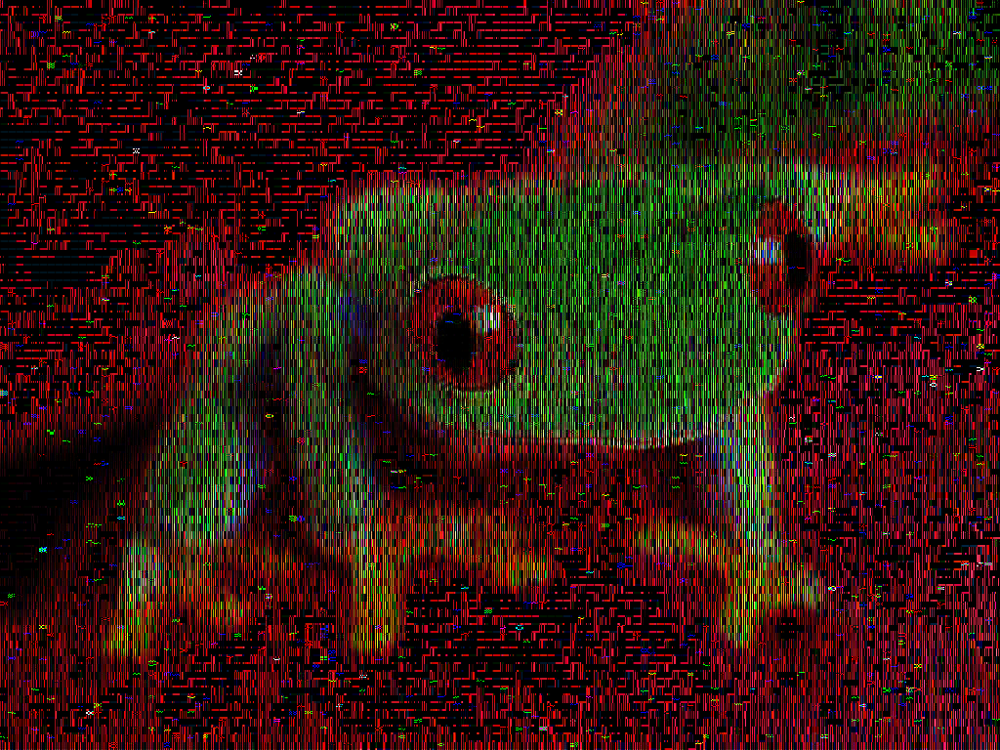
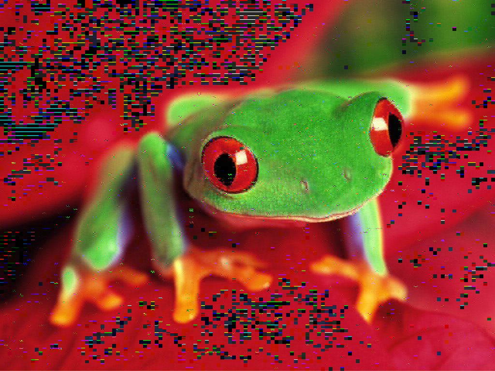
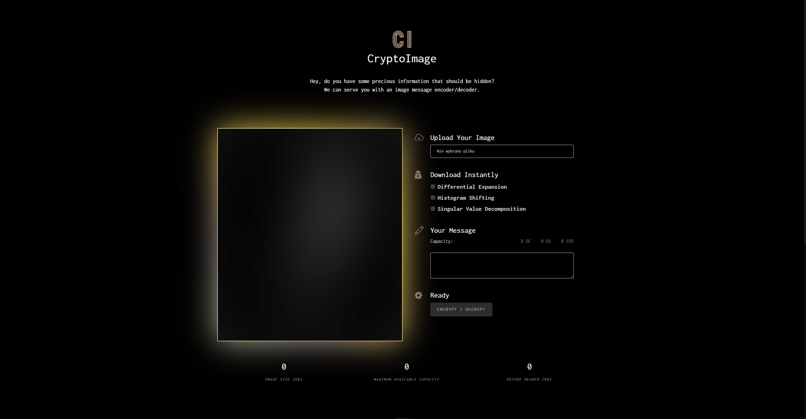

  
  <h2 align="center">CryptoImage</h2>
  <h5 align="center">Final Report on the Project for the course</h5> <h5 align="center"><i>"Engineering of Acquiring and Protecting Knowledge from Data and Databases"</i></h5>
  

    <a href="https://luzkan.github.io/CryptoImage/" align="center"><strong>Explore the App »</strong></a>
     
    <a href="https://github.com/Luzkan/CryptoImage/blob/master/README.md">Readme</a>
    ·
    <a href="https://github.com/Luzkan/CryptoImage/issues/new">Report Bug</a>
    ·
    <a href="https://github.com/Luzkan/CryptoImage/issues/new">Request Feature</a>
    ·
    <a href="https://github.com/Luzkan/CryptoImage/blob/master/docs/CHANGELOG.md">Changelog</a>
  

 
 

# Report

## Abstract

The <a href="https://luzkan.github.io/CryptoImage/">CryptoImage</a> project ended as a great success - both in terms of the functionality and usability. The project was a great learning experience for all of us, and we've learned a lot about the development process based on scientific literature and the importance of documentation. The goal of the project was to provide an usable application that can be used in order to hide and reveal hidden information from image files and we have managed to do so satisfactorily. In addition, we focused on a modern web application which makes the process of hiding and revealing information very convenient as it can be accessed on majority of the platforms without the need to install any software.

## Implementation

### **Algorithms**

We have implemented three different algorithms for the hiding process, which are [Differential Expansion](#differential-expansion) ([code](https://github.com/Luzkan/CryptoImage/blob/master/src/algorithms/differential-expansion.ts)), [Histogram Shifting](#histogram-shifting) ([code](https://github.com/Luzkan/CryptoImage/blob/master/src/algorithms/histogram-shifting.ts)) and [Singular Value Decomposition](#Singular-Value-Decomposition) ([code](https://github.com/Luzkan/CryptoImage/blob/master/src/algorithms/singular-value-decomposition.ts)). The application is able to hide information in an image file of `.bmp` format and reveal it back. The results can be instantly inspected and compared with the original image right after the encryption process.

#### **Differential Expansion**

##### [Paper](./papers/.pdf), [Wikipedia - _Differential Form_](https://en.wikipedia.org/wiki/Differential_form)

Implemented Algorithm:

* All pixel values are converted to a flat array. Channels are not mixed and are concatenated channel by channel.
* Flat array is divided into pairs.
* For all pairs Differential Bits Map is created. For each index of pairs, it has an assigned value equal to the number of bits necessary to write the difference value between values in pairs.
* Creating location map for indexes in Differential Bits Map which value is 7. We will try to save a payload in pairs which difference takes not more than 7 bits. A location map is necessary to make it possible to revert the encoded image to its original state. After encoding payload in pair with difference 7, its difference now is 8 so equal to unencoded pair with original difference 8. This map allows us to distinguish between pairs with or without payload.
* Location map is converted to bytes and compressed using Huffman Compress algorithm.
* Message to be encoded is converted to a bit array
* Final payload is built and is the concatenation of compressed Location Map and bits of the message
* Payload write order is created. The algorithm writes payload bits start from pairs with the smallest value from the Differential Bits Map.
* Using encoding order the payload is written by shifting the difference and putting the payload bit in the LSB.
* If the payload is smaller than image capacity rest of pairs encode value 0.
* Encoded pixel pairs are converted back to BMP images.

The decoding process consists in reversing the encoding algorithm. Tips:
* Tricky thing is that after encoding value in pair with a difference taking 0 bits new difference not always takes 1 bit. If the encoding value is 0 then the new difference is still 0.
* Splitting payload on a Location map and message bits can be made because of knowing the length of location map (which number of pixel pairs).

#### **Histogram Shifting**

##### [Paper](./papers/.pdf), [Wikipedia - _Histogram_](https://en.wikipedia.org/wiki/Histogram)

Implemented Algorithm:

* Convert all pixel values to the flat array.
* Build Histogram based on the prepared array.
* Extract valueWithMinCount, minValueCount, valueWithMaxCount from histogram
* Prepare payload header. If minValueCount is 0 then the header has only 1 bit with a value 0. In another way:
    * Set first bit of header to 1 (it means that header is in the extended version)
    * Create Location Map for values equal to valueWithMinCount.
    * Convert Location map to bytes and compress it using Huffman Compress algorithm
    * Attach compressed Location Map to payload header.
* Convert Message to be encoded to bit array.
* Build final payload by concatenating Payload Header and bits of message.
* Shift all pixels values with values between valueWithMinCount and valueWithMaxCount by 1 point to towards valueWithMinCount. (We make a gap in histogram next to valueWithMaxCount value)
* Write payload bits by a splitting sequence of pixels with a value equal to valueWithMaxCount into two. If the coding value is 0 then the pixel value is not changing. When the value is 1 then we change the pixel value with 1 point filling the prepared gap in the histogram.
* Convert encoded pixels into BMP image.

The decoding process consists in reversing the encoding algorithm.

#### **Singular Value Decomposition**

##### [Paper](./papers/.pdf), [Wikipedia - _Singular Value Decomposition_](https://en.wikipedia.org/wiki/Singular_value_decomposition)

Singular Value Decomposition (SVD) is a mathematical concept that gained significant popularity in the field of computer graphics. It has been shown in numerous papers that it can be effectively used as a method of encoding messages onto a bitmap.

Because of its mathematical nature, several difficulties arise when applying the SVD method to the computer world. Martix values in theory can take any real values wheras pixel values can only be integers from the 0-255 range. Very big numbers result in int overflow and numbers close to zero might be interpreted as simply zero which can lead to several computational errors and misrepresentations. Because of that, the SVD method in its pure form is highly ineffective when transposed to a programming language. Every modern paper concerning the SVD embedding algorithm employs some sort of an enhancement used to increase the effectiveness of the method. During our work we discovered that it would also be necessary to apply enhancements in order to raise the effectiveness of the method to a decent level.

Our initial implementation of algorithm can be described as follows:

1. The image is divided into 8x8 blocks.
2. Each block _A_ is decomposed into three martices using the SVD method _A_ = _U_ _S_ _VT_
3. The message is encoded throughout the  available space on matrix _U_ (see the figure below) by setting the sings of matrix values to plus or minus depending whether 1 or 0 is to be embedded.
4. The resulting matrix is readjusted as to keep its orthogonality.
5. The watermarked matrix is constructed _A'_ = _U'_ _S_ _VT_
6. _A'_ is rounded so that each of its value is an integer from range 0-255.
7. Rounded _A'_ is used to assemble the watermarked image.

    
    
Matrix <i>U</i>. Message bits are embedded in white fields. <i>Preserved columns</i> remain untouched to ensure that resulting image resembles the original one. Yellow fields are calculated on the fly using Gaussian Elimination to ensure that the resulting matrix is orthogonal. 

This is the simplest version of SVD embedding algorithm. It proved to be insufficient to effectively embed and extract a message. It's effectiveness (percentage of correctly decoded bits) was only slightly higher than 50%. We put a lot of effort to find out why the effectiveness was so low and how to improve it. Here is what we found:

* After decomposition (transforming the matrix _A_ into three matrices _U'_ _S_ _VT_) it often happened that the matrix values were either `Infinity` or `NaN` which resulted in faulty embedding process. To avoid that we included a pre-check step to the procedure - if any of the _U'_ _S_ _VT_ matrices had those values, the processed block was skipped.

* Some blocks yield better encoding results than others. SVD works best for "diverse" matrices. A matrix with variety in its values gave better results than matrices with similar or identical values. Next improvement of our method was filtering out potentially "ineffective" blocks which was added to the aforementioned pre-check step. To check if a block was "ineffective" a sample encode/decode operation is performed using a message `[1, 0, 1, 0, ...]`. If the number of correctly decoded bits is lower than the `correctBitsThreshold` parameter the block is skipped.

* Following a paper on SVD method we initially preserved only one column of the _U_ matrix. Some other papers suggested that preserving two or more columns might improve the effectiveness of the method. To control the number of preserved columns a `preservedColumns` parameter was added. We increased it to `2` which gave method a slight effectiveness boost and improved the look of the resulting image. 

After applying those steps, the effectiveness of our method spiked up to around 60%. Given that each character consists of 8 bits, it means that there is around 1,7% chance of correctly decoding a character which obviously is not ideal. 

We then tried to improve the effectiveness even more by duplicating the encoded message (using the `repetitionNumber` parameter). In theory this method could highly improve the effectiveness - even up to 99,5%. In practice, it broke the method. Because of the pre-check step, the method falsely assumed encoded blocks to be the blocks skipped during encoding. When the method then tried to merge the duplicated messages into one, the duplicated blocks didn't match one another. The resulting decoded message was a complete **mess**. 

Further work could be done on "helping" the decoding method correctly identify previously skipped blocks. It is also possible that the core SVD method could be improved to such extent as to completely abandon the pre-check step which would solve the duplication issues.

<table>
  <tr>
    <td>
      

        
        
First, buggy version of the algorithm. A single transposition operation was missing from the procedure which severely distorted the resulting image.

      

    </td>
    <td>
      

        
        
Fixed version. Corrupted blocks are the ones that were the least "diverse". Next step was to implement a pre-check algorithm to filter out those blocks.

      

    </td>
    <td>
      

        
        
Final version after implementing the enhancements. Two columns are preserved and the <i>correctBitsThreshold</i> parameter is set to 10.

      

    </td>
  </tr>
</table>

### **Web Application**

    
    
Mainscreen

#### **Interface Design**

The website is a single page application with a responsive design. Along with the guiding idea, which is cryptography, website is correspondently themed in a dark style with beige accent color. We have even created a customized logo for the application which can be treated as a cherry on top of a full-featured application.

All the actions that user has to perform are placed into one side-column, so he does not get distracted or lost and can just go from top to bottom with quick 3 steps setup.

At the bottom of the main section, there are three counters that are displaying different kind of data about the inserted image which can be cool for some of the users, but mostly it is there for that 'responsive' feel (user immediately sees that the image is being processed and some deep math magic is already happening).

#### **User Experience**

Website is designed to be intuitive and easy to use, responsive to the user actions. To mention few examples - the website has capacity counters for each algorithm, so that user knows instantly whether the message he tries to hide can be hidden in the image or not. If the capacity is exceeded for one of the method, user sees the negative values on capacity and locked download option with red color highlighting. 

Another small _quality of life_ feature is that the error message on the encrypt button will change accordingly to the missing user actions. If the user didn't input a message yet and didn't input an image, the error message will inform about both issues and change accordingly to the actions that user performed.

The images in the result section are initially showcased side-by-side without any information with which kind of algorithm was used to hide the message. The user can hover the image to reveal the algorithm and click it to enlarge it in the lightroom-like fashion. User can further hover on the enlarged image to upscale it a bit further for more detailed inspection and click wherever, to close it.

    
    
Encrypted Images Section

Last thing that we can mention, is the automated scroll effect which navigates the user to the results section if he successfully encrypts his data for that smooth _carried-by-the-hand_ feeling.

### **Technicalities**

We've used [TypeScript](https://www.typescriptlang.org/) for the project, which is a great tool for the development of web applications. It is basically a superset of [JavaScript](https://developer.mozilla.org/en-US/docs/Web/JavaScript) with syntax for types. To keep things simple, we wrote the development `.ts` code and then used `tsc` command to convert it into `.js` files (into the `dist`-tribution directory) that can be executed by everyone through the browser. This `dist`-tribution directory is the one that is served by the application with [Github Pages](https://pages.github.com/).

### **Documentation**

The exhaustive description of the project is available on the [Github](https://github.com/Luzkan/CryptoImage). It covers the introduction, development and the related work (list of research papers). We have also used [changelog](https://keepachangelog.com/en/1.0.0/) which can be found in the `docs` directory [here](https://github.com/Luzkan/CryptoImage/blob/master/docs/CHANGELOG.md).

## Team

- **Marcel Jerzyk** ([github](https://github.com/Luzkan/) / [linkedin](https://www.linkedin.com/in/luzkan/))
- **Krzysztof Szafraniak** ([github](https://github.com/InBinaryWorld) / [linkedin](https://www.linkedin.com/in/krzysztof-szafraniak-18b927207/))
- **Jacek Wernikowski** ([github](https://github.com/werekkk))
